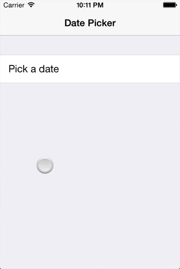

AIDatePickerController
--------------------
UIDatePicker modally presented with iOS 7 custom transitions. Does not support rotation yet.

<p align="center"></p>

##Usage

```objc
// Create a date
NSDateFormatter *dateFormatter=[[NSDateFormatter alloc] init];
[dateFormatter setDateFormat:@"yyyy-MM-dd"];
NSDate *date = [dateFormatter dateFromString:@"1955-02-24"];


// Create an instance of the picker
AIDatePickerController *datePickerViewController = [AIDatePickerController pickerWithDate:date selectedBlock:^(NSDate *selectedDate) {
    // Do what you want with the picked date.
} cancelBlock:^{
    // Do what you want when the user pressed the cancel button.
}];

// Present it
[self presentViewController:datePickerViewController animated:YES completion:nil];
```

##Requirements
- iOS >= 7.0
- ARC

##Credits
Inspired by **roland.moers**'s [RMDateSelectionViewController](https://github.com/CooperRS/RMDateSelectionViewController).

## Contact

Ali Karagoz
- http://github.com/alikaragoz
- http://twitter.com/alikaragoz

## License

AIDatePickerController is available under the MIT license. See the LICENSE file for more info.
